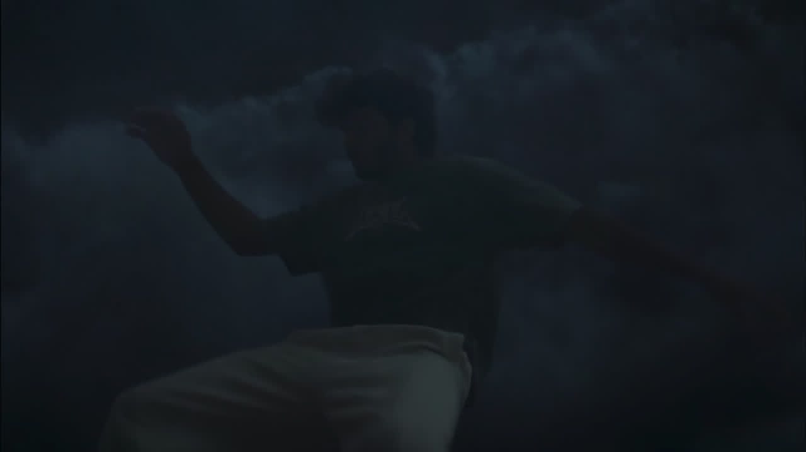
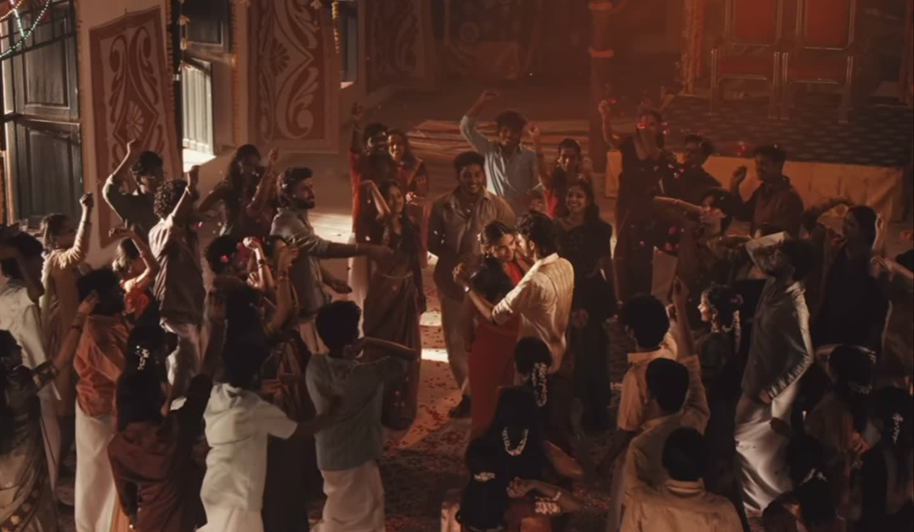
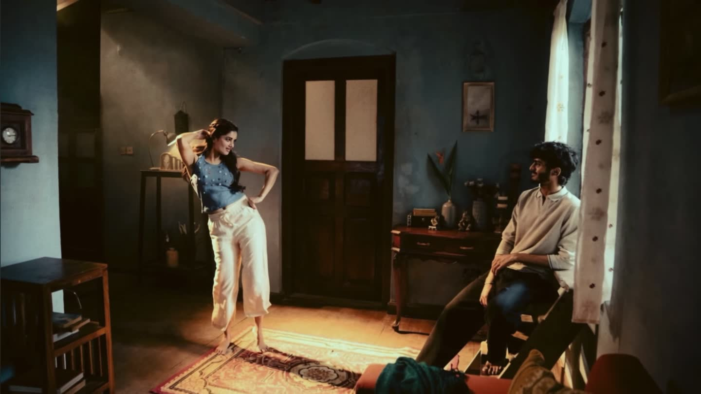
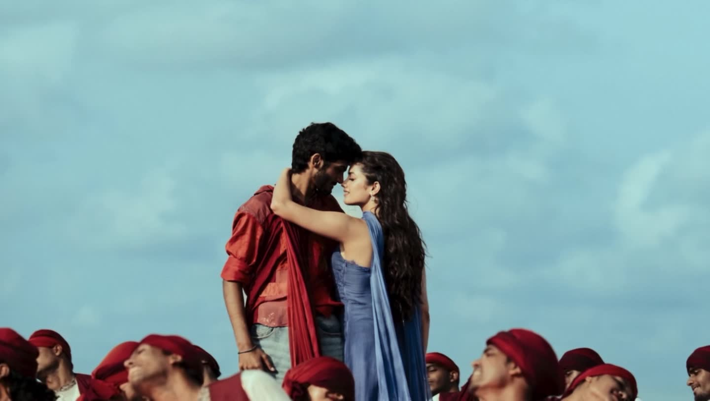
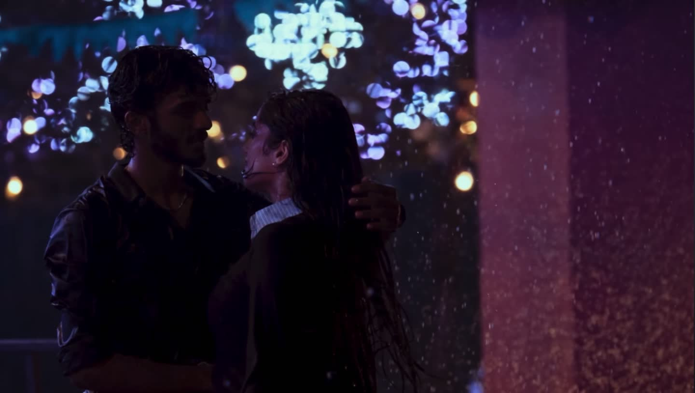
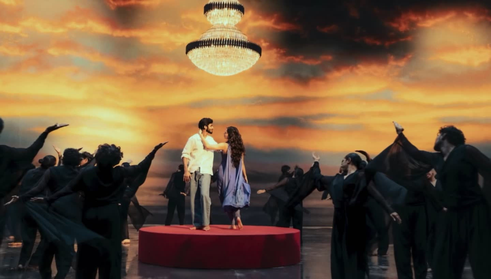

<div align="center">


### A cinematic, scroll-driven storytelling experience

An immersive web film built with **HTML, CSS and vanilla JavaScript** — combining atmospheric video, responsive motion, layered visual effects and narrative typography.

<br>

[](https://radhimaa.pages.dev/)
[](https://pages.cloudflare.com/)
[](#tech-stack)
[](#credits)

<br>



</div>

---

## ✦ About Radhimaa

**Radhimaa** is an experimental cinematic website designed to feel more like a short film than a conventional webpage.

The experience moves through multiple visual chapters. Video, typography, atmospheric particles, lighting treatments and transitions work together to create a continuous narrative as the visitor scrolls.

The project is intentionally framework-free: the browser receives the site directly, with no application runtime or build framework between the experience and the viewer.

---

## 🎞️ The Experience

<table>
<tr>
<td width="50%" align="center">
<br>
<b>II — How I loved her</b><br>
<sub>Memory, warmth and quiet intimacy.</sub>
</td>
<td width="50%" align="center">
<br>
<b>III — Ordinary mornings</b><br>
<sub>Light enters the room and changes the frame.</sub>
</td>
</tr>
<tr>
<td width="50%" align="center">
<br>
<b>IV — Everything at once</b><br>
<sub>An open-sky chapter with layered atmospheric motion.</sub>
</td>
<td width="50%" align="center">
<br>
<b>V — A night that stayed on</b><br>
<sub>Rain, bokeh and a darker cinematic palette.</sub>
</td>
</tr>
</table>

<div align="center">


**VI — After everything**

</div>

---

## ✨ Highlights

- 🎬 Full-screen cinematic video chapters
- 🖱️ Scroll-driven narrative progression
- 🌗 Scene-specific colour grading and lighting treatments
- 🌸 Procedural petals, flowers, particles and ambient effects
- 🦋 Layered butterfly and atmospheric motion
- 📱 Separate desktop and mobile video compositions
- ⚡ Progressive media loading for a smoother first visit
- 🖼️ Poster fallbacks for media loading
- 🔇 Browser-safe muted autoplay behaviour
- ♿ Reduced-motion support
- 🎨 Responsive typography and cinematic framing
- ☁️ Static deployment on Cloudflare Pages

---

## 🧱 Tech Stack

<div align="center">

| Layer | Technology |
|---|---|
| Structure | HTML5 |
| Styling | CSS3 |
| Motion & Interaction | Vanilla JavaScript |
| Media | MP4 / WebM / WebP |
| Rendering | Canvas + DOM animation |
| Hosting | Cloudflare Pages |
| Build system | None — static deployment |

</div>

No framework. No bundler. No runtime dependency.

---

## 🗂️ Project Structure

```text
Radhimaa/
│
├── index.html
│
├── assets/
│   ├── css/
│   │   ├── hero.css
│   │   ├── memory.css
│   │   ├── sunrise.css
│   │   ├── sky.css
│   │   ├── rain.css
│   │   └── finale.css
│   │
│   ├── js/
│   │   ├── hero.js
│   │   ├── scrub.js
│   │   ├── memory.js
│   │   ├── sunrise.js
│   │   ├── sky.js
│   │   ├── rain.js
│   │   ├── finale.js
│   │   ├── petals.js
│   │   ├── wings.js
│   │   ├── lumen.js
│   │   └── bloom.js
│   │
│   ├── img/
│   └── video/
│
├── tools/
│   └── dev-server.mjs
│
└── SETUP.md
```

---

## ▶️ Run Locally

This site should be served through HTTP rather than opened directly as a `file://` document.

Clone the repository:

```bash
git clone https://github.com/vaikashhari/Radhimaa.git
cd Radhimaa
```

Run the included local server:

```bash
node tools/dev-server.mjs . 8123
```

Then open:

```text
http://localhost:8123
```

The included server supports the media behaviour needed by the experience.

---

## ☁️ Deploying to Cloudflare Pages

Radhimaa is a static site, so there is no framework build step.

Use these settings:

```text
Framework preset:       None
Root directory:         /
Build command:          leave blank
Build output directory: .
```

Cloudflare Pages will publish the repository assets directly to its CDN.

### Live deployment

**https://radhimaa.pages.dev/**

---

## 🎥 Media Strategy

The site includes different media variants for desktop and mobile layouts.

```text
scene-desktop.mp4
scene-desktop-2x.mp4
scene-mobile.mp4
scene-mobile-2x.mp4
scene-poster.jpg
```

The shared scene transport handles source selection, progressive loading and visibility-based playback so heavy cinematic assets do not all compete for bandwidth at initial page load.

---

## 🧠 Design Philosophy

> The interface should disappear until only the story remains.

Radhimaa avoids conventional cards, dashboards and content blocks. Each section is treated as a film frame: typography is composed around the footage, effects are tied to the scene's lighting, and movement is deliberately restrained so the visual story remains the focus.

---

## 🛠️ Key Files

| File | Purpose |
|---|---|
| `index.html` | Main narrative structure and chapter markup |
| `assets/js/hero.js` | Opening experience, UI and ending content |
| `assets/js/scrub.js` | Shared middle-chapter video/scroll transport |
| `assets/js/petals.js` | Procedural petal field |
| `assets/js/wings.js` | Butterfly and atmospheric world |
| `assets/js/bloom.js` | Finale flower system |
| `assets/css/*.css` | Scene-specific art direction |
| `SETUP.md` | Detailed setup and deployment documentation |

---

## 📌 Notes

- The experience is media-heavy by design.
- Video playback is muted where required for browser autoplay compatibility.
- High-resolution plates are selected conservatively to protect loading performance.
- Mobile and desktop scenes use dedicated compositions rather than simple scaling.
- The project is optimized for modern Chromium, Safari and Firefox browsers.

---

## Credits

<div align="center">

### Built by **Creatary Labs**

Creative development · Cinematic web experiences · Interactive storytelling

<br>

**Radhimaa © 2026**

<br>

[](https://github.com/vaikashhari)

</div>

---

<div align="center">

### ✦ Every melody has a memory. ✦

[**Experience Radhimaa →**](https://radhimaa.pages.dev/)

</div>
